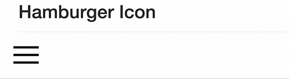

# Hamburger-Icon

>
> 
>

## Here are using the languages as below.
- [x] HTML
- [x] CSS
- [x] JAVASCRIPT

This example similar with ["A Cool Responsive Email Button"](https://github.com/Kimmy-Poon/A-Cool-Responsive-Email-Button), which is quite easy to develop via CSS and Javascript.

A bit different technical skills as below.
```JavaScript
function isMobile(){
	var isMobile = (/iphone|ipod|android|ie|blackberry|fennec/).test(navigator.userAgent.toLowerCase());
	return isMobile;
}
```
This function is used to detect mobile version or not, which is useful if you would like to develop something responsive.

> Easy? and Interesting? Let's DO it. :hand_over_mouth:
